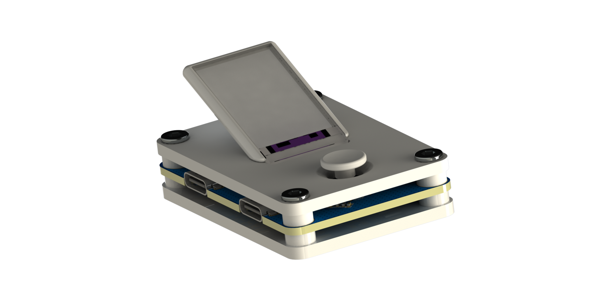

<i>ADC采样卡
===
### 产品特点
 - 8通道😮
 - 最大200kSPS采样率😆
 - 拥有1.14寸显示屏，可离线使用😍
---
### V2.X版本渲染图

---
### 工程文件结构
```shell
ROOT
├─3d            3D建模文件
├─docs          工程文档
├─example       参考文件
├─firmware      产品固件
├─hardware      产品硬件文件
├─software      产品上位机文件
└─produce       产品生产文件
```
| 文件夹说明链接 |
| ---- | 
| [3d](../3d/docs/README.md) |
| [example](../example/docs/README.md) |
| [firmware](../firmware/docs/README.md) |
| [hardware](../hardware/docs/README.md) |
| [software](../software/docs/README.md) |
| [produce](../produce/docs/README.md) |

### 版本说明
| 版本 | 说明 | 可用性 |
| --- | --- | --- |
| V1.X | 使用DCDC进行5V-3.3V降压 | 不可用、由于MCU的VDDA和VSSA未连接电源，导致芯片工作不正常
| V2.X | 使用LDO进行5V-3.3V降压、排母位置微调 | 暂未测试 |


